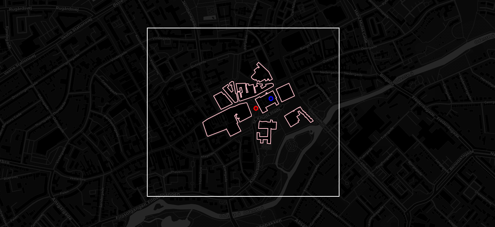

# Geolocator Component



This repository contains a python script along with a configured stack of
technologies ([Overpass](https://wiki.openstreetmap.org/wiki/Overpass_API) and
[Redis](https://redis.io/)) that makes it possible to efficiently determine
whether a given point in space is close to or contained in another geospatial
feature, such as a polygon. In other words, we can determine if
a *location is inside or close to e.g. a building*.

See the following for a brief overview of how the the python script and
technology stack work:

1. Given a location in terms of longitude and latitude in decimal degrees,
   geohash the location using a [hilbert space filling
   curve](https://github.com/tammoippen/geohash-hilbert).
2. Use the computed geohash as a key to check in Redis if a [sorted
   set](https://redislabs.com/ebook/part-2-core-concepts/chapter-3-commands-in-redis/3-5-sorted-sets/)
   of geospatial features have been cached for the bounding box encoded by the
   geohash. 
3. If the key exists then use the given location to query the `k` closest
   geospatial features in the sorted set and use the
   [shapely](https://shapely.readthedocs.io/en/stable/manual.html) python
   library to determine if the given location is contained in one of the `k`
   returned geospatial features from Redis.
4. If the key does not exist in Redis, then build a query to OpenStreeMap's
   Overpass API to retrieve all geospatial features in the bounding box encoded
   by the geohash. Cache the returned data from Overpass in Redis by using the
   geohash as key, then use shapely to determine if the given location is
   contained in one of the geospatial features returned from Overpass. 

Note: Sorted sets of geospatial features are regularly purged from Redis based
on a user-defined time-to-live (ttl) value. This is done to make sure stale data
from Overpass do not accummulate, stay in cache and take up too much unnecessary
memory.  

## Usage

1. Set appropriate values in the `overpass.env` file
2. Build and start the Redis and Overpass docker containers with docker-compose:
```
docker-compose up
```
3. Install python dependencies:
```
pip install -r requirements.txt
```
4. See examples in the jupyter notebook:
   [html](https://nicklasxyz.github.io/Geolocator/) or [.ipynb](index.ipynb)
